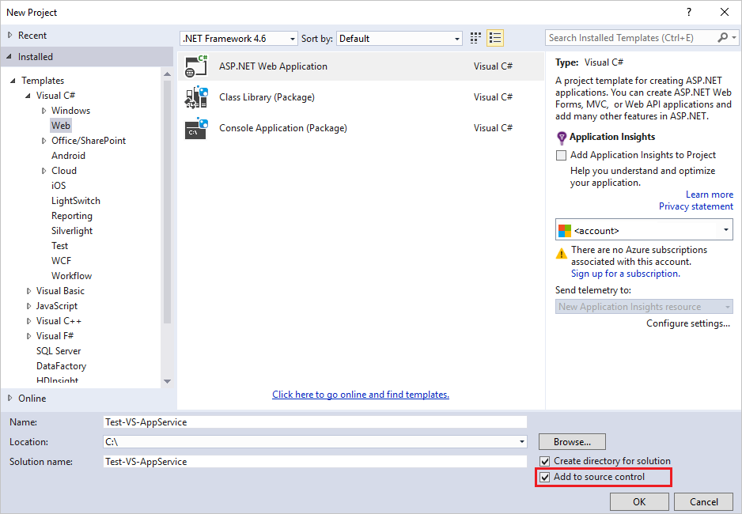
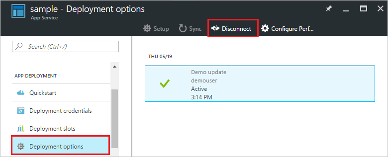

# Continuous Deployment to Azure App Service

[!INCLUDE [azure-sdk-developer-differences](../../includes/azure-sdk-developer-differences.md)]

This tutorial shows you how to configure a continuous deployment workflow for your [Azure App Service] app. App Service integration with BitBucket, GitHub, and [Visual Studio Team Services (VSTS)](https://www.visualstudio.com/team-services/) enables a continuous deployment workflow where Azure pulls in the most recent updates from your project published to one of these services. Continuous deployment is a great option for projects where multiple and frequent contributions are being integrated.

To find out how to configure continuous deployment manually from a cloud repository not listed by the Azure Portal Preview (such as [GitLab](https://gitlab.com/)), see
[Setting up continuous deployment using manual steps](https://github.com/projectkudu/kudu/wiki/Continuous-deployment#setting-up-continuous-deployment-using-manual-steps).

## <a name="overview"></a>Enable continuous deployment
To enable continuous deployment,

1. Publish your app content to the repository that will be used for continuous deployment.  

    For more information on publishing your project to these services, see [Create a repo (GitHub)], [Create a repo (BitBucket)], and [Get started with VSTS]. The folloing steps are only for GitHub Repo. For Repo other than GitHub's, see [Manually triggering a deployment](https://github.com/projectkudu/kudu/wiki/Manually-triggering-a-deployment) to setup the webhook.

2. In your app's menu blade in the [Azure portal preview], click **APP DEPLOYMENT > Deployment options**. Click **Choose Source**, then select **External Repository**.
2. Enter the url of you GitHub Repo, and enter the branch you want to track. Leave the **Repository Type** to be Git, and click **OK**

    > [!NOTE]
    > Azure China currently only support public repository, because there is no way we can enter the git credential for the web app.

    Azure creates an association with the selected repository, pulls in the files from the specified branch, and maintains a clone of your repository for your Azure Web App.
3. In the **Overview** blade of your app, click **Get publish profile** to download the publish profile of you web app.
4. Open the publish profile with a text editor, and get the following values.

    ```
    userName="$<YOUR_WEB_APP>" userPWD="<SOME_BIG_RANDOM_TOKEN>"
    ```
5. In the page of you GitHub Repo, click **Settings**, choose **Webhooks & services**, and then click **Add webhook**
6. In **Payload URL**, enter `https://$<YOUR_WEB_APP>:<SOME_BIG_RANDOM_TOKEN>@<YOUR_WEB_APP>.scm.chinacloudsites.cn/deploy`, leave everything else as what it was, and click **Add webhook** to save the new webhook.
5. To verify the app is successfully deployed, click the **URL** at the top of the app's blade in the Azure portal preview.
6. To verify that continuous deployment is occurring from the repository of your choice, push a change to the repository. Your app should update to reflect the changes shortly after the push to the repository completes. You can verify that it has pulled in the update in the **Deployment options** blade of your app.

## <a name="VSsolution"></a>Continuous deployment of a Visual Studio solution

[!INCLUDE [azure-sdk-developer-differences](../../includes/azure-visual-studio-login-guide.md)]

Pushing a Visual Studio solution to Azure App Service is just as easy as pushing a simple index.html file. The App Service deployment process streamlines all the details, including restoring NuGet dependencies and building the application binaries. You can follow the source control best practices of maintaining code only in your Git repository, and let App Service deployment take care of the rest.

The steps for pushing your Visual Studio solution to App Service are the same as in the [previous section](#overview), provided that you configure your solution and repository as follows:

* Use the Visual Studio source control option to generate a `.gitignore` file such as the image below or manually add a `.gitignore` file in your repository root with content similar to this [.gitignore sample](https://github.com/github/gitignore/blob/master/VisualStudio.gitignore).

    
* Add the entire solution's directory tree to your repository, with the .sln file in the repository root.

Once you have set up your repository as described, and configured your app in Azure for continuous publishing from one of the online Git repositories, you can develop your ASP.NET application locally in Visual Studio and continuously deploy your code simply by pushing your changes to your online Git repository.

## <a name="disableCD"></a>Disable continuous deployment
To disable continuous deployment,

1. In your app's menu blade in the [Azure portal preview], click **APP DEPLOYMENT > Deployment options**. Then click **Disconnect** in the **Deployment options** blade.

    
2. After answering **Yes** to the confirmation message, you can return to your app's blade and click **APP DEPLOYMENT > Deployment options** if you would like to set up publishing from another source.

## Additional Resources
* [How to investigate common issues with continuous deployment](https://github.com/projectkudu/kudu/wiki/Investigating-continuous-deployment)
* [How to use PowerShell for Azure]
* [How to use the Azure Command-Line Tools for Mac and Linux]
* [Git documentation]
* [Project Kudu](https://github.com/projectkudu/kudu/wiki)
* [Use Azure to automatically generate a CI/CD pipeline to deploy an ASP.NET 4 app](https://www.visualstudio.com/docs/build/get-started/aspnet-4-ci-cd-azure-automatic)

[Azure App Service]: /azure/app-service-changes-existing-services/
[Azure portal preview]: https://portal.azure.cn
[VSTS Portal]: https://www.visualstudio.com/products/visual-studio-team-services-vs.aspx
[Installing Git]: http://git-scm.com/book/zh/v2/%E8%B5%B7%E6%AD%A5-%E5%AE%89%E8%A3%85-Git
[How to use PowerShell for Azure]: https://docs.microsoft.com/powershell/azureps-cmdlets-docs
[How to use the Azure Command-Line Tools for Mac and Linux]:../cli-install-nodejs.md
[Git Documentation]: http://git-scm.com/documentation

[Create a repo (GitHub)]: https://help.github.com/articles/create-a-repo
[Create a repo (BitBucket)]: https://confluence.atlassian.com/display/BITBUCKET/Create+an+Account+and+a+Git+Repo
[Get started with VSTS]: https://www.visualstudio.com/docs/vsts-tfs-overview
[Continuous delivery to Azure using Visual Studio Team Services]: ../articles/cloud-services/cloud-services-continuous-delivery-use-vso.md