# Map a custom DNS name to an Azure web app

This tutorial shows you how to map a custom DNS name (i.e. vanity domain) to your web app, mobile app backend, or API app in [Azure App Service](../app-service/app-service-value-prop-what-is.md). 

This tutorial follows the example scenario of mapping two DNS names to an app in App Service:

- `contoso.com` - a root domain. You will use an [A record](https://en.wikipedia.org/wiki/List_of_DNS_record_types#A) to map it to Azure. 
- `www.contoso.com` - a subdomain of `contoso.com`. You can use either an [A record](https://en.wikipedia.org/wiki/List_of_DNS_record_types#A) or a [CNAME record](https://en.wikipedia.org/wiki/CNAME_record).

The tutorial also shows you how to map a [wildcard DNS](https://en.wikipedia.org/wiki/Wildcard_DNS_record) to App Service (e.g. `*.contoso.com`).

## Before you begin

Since this tutorial shows you how to map a DNS name to Azure App Service, you must have administrative access to the DNS configuration page for your respective domain provider (e.g. GoDaddy). For example, to add a mapping for `contoso.com` and `www.contoso.com`, you need to be able to configure DNS entries for `contoso.com`.

## Step 1 - Prepare your app
To map a custom DNS name, your[App Service plan](https://www.azure.cn/pricing/details/app-service/) must be in the **Shared** tier or above. In this step, you make sure that your Azure app is in the supported pricing tier.

### Log in to Azure

Open the Azure portal preview. 

To do this, sign in to [https://portal.azure.cn](https://portal.azure.cn) with your Azure account.

### Navigate to your app
From the left menu, click **App Service**, then click the name of your Azure app.

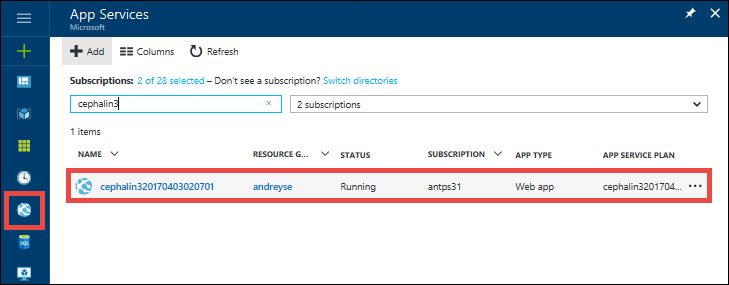

You have landed in your app's _blade_ (a portal page that opens horizontally).  

### Check the pricing tier
In the **Overview** page, which opens by default, check to make sure that your app is not in the **Free** tier.

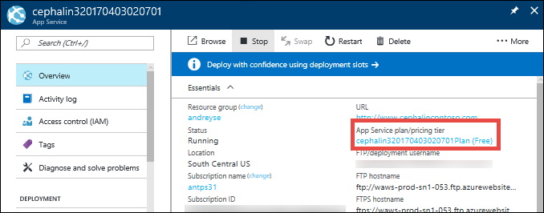

Custom DNS is not supported in the **Free** tier. If you need to scale up, follow the next section. Otherwise, skip to [Step 2](#info).

### Scale up your App Service plan

To scale up your plan, click **Scale up (App Service plan)** in the left pane.

Select the tier you want to scale to. For example, select **Shared**. When ready, click **Select**.

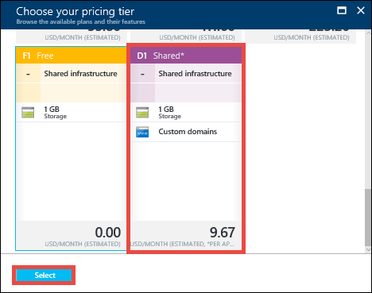

When you see the notification below, the scale operation is complete.

##  Step 2 - Get mapping information

In this step, you obtain the information that you will need to create the DNS record(s) later. 

### Open the custom domain UI

In your app's blade, click **Custom domains** in the menu. 

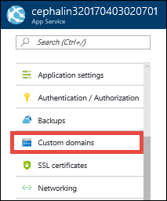

### Copy the mapping information

In th **Custom domains** page, copy the app's **IP address** and its default hostname under **Hostnames assigned to site**.

You will need the IP address later for the A record mapping, and the default hostname for the CNAME record mapping.

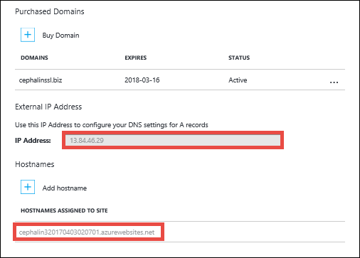

## Step 3 - Add DNS records 

In this step, you add the DNS records you need to map your custom DNS to your app. You perform this step with your own domain provider.

### Access DNS records with domain provider

First, log in to the website of your domain provider.

Then, you need to find the page for managing DNS records. Every domain provider has its own DNS records interface, so you should consult your provider's documentation. In general, you should look for links or areas of the site labeled **Domain Name**, **DNS**, or **Name Server Management**. Often, you can find the link by viewing your account information, and then looking for a link such as **My domains**. 

Then, look for a link that lets you manage DNS records. This link might be named **Zone file**, **DNS Records**, or **Advanced configuration**.

The following screenshot is an example of what your DNS records page may look like:

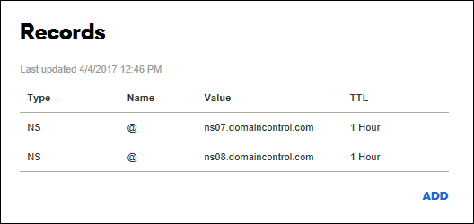

In the example screenshot, you click **Add** to create a record. Some providers have different links to add different record types. Again, consult your provider's documentation.

> [!NOTE]
> For certain providers, changes to DNS records don't become effective until you click a separate **Save Changes** link after you create them. 
>
>

###  Create an A record

In the tutorial example, you want to add an A record for the root domain, `contoso.com`. 

To map an A record to your app, App Service actually requires _two_ DNS records:

- An **A** record to map to your app's IP address.
- A **TXT** record to map to your app's default hostname. This record lets App Service verify that you own the custom domain you want to map.

The following table shows you how you would configure an A record mapping for the supported domain types (`@` typically represents the root domain). 

<table cellspacing="0" border="1">
  <tr>
    <th>Domain type</th>
    <th>Record type</th>
    <th>Host</th>
    <th>Value</th>
  </tr>
  <tr>
    <td rowspan="2" align="left">Root domain (e.g. <code>contoso.com</code>)</td>
    <td>A</td>
    <td>@</td>
    <td>IP address from <a href="#info">Step 2</a></td>
  </tr>
  <tr>
    <td>TXT</td>
    <td>@</td>
    <td>Default hostname from <a href="#info">Step 2</a></td>
  </tr>
  <tr>
    <td rowspan="2" align="left">Subdomain (e.g. <code>www.contoso.com</code>)</td>
    <td>A</td>
    <td>www</td>
    <td>IP address from <a href="#info">Step 2</a></td>
  </tr>
  <tr>
    <td>TXT</td>
    <td>www</td>
    <td>Default hostname from <a href="#info">Step 2</a></td>
  </tr>
  <tr>
    <td rowspan="2" align="left">Wildcard domain (e.g. <code>*.contoso.com</code>)</td>
    <td>A</td>
    <td>\*</td>
    <td>IP address from <a href="#info">Step 2</a></td>
  </tr>
  <tr>
    <td>TXT</td>
    <td>\*</td>
    <td>Default hostname from <a href="#info">Step 2</a></td>
  </tr>
</table>

For the `contoso.com` domain example, your DNS records page show look like the following screenshot:

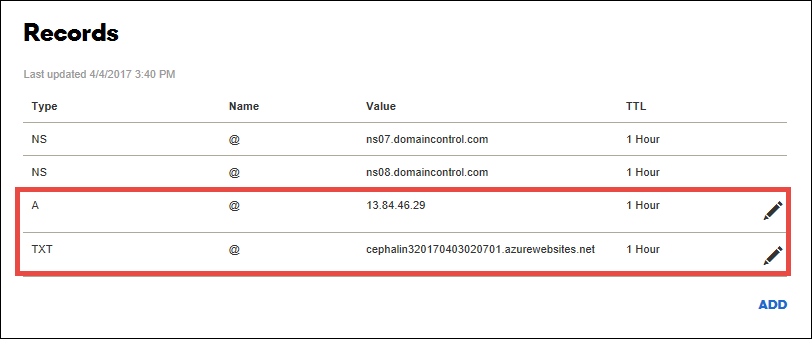

###  Create a CNAME record
In the tutorial example, you want to add a CNAME record for the root domain, `contoso.com`. 

Unlike [mapping an A record](#a), mapping a CNAME record to your app doesn't require any additional record.

> [!IMPORTANT]
> It is recommended that you use a CNAME mapping. If you delete and recreate your app, or change from a dedicated hosting tier back to the **Shared** tier, your app's virtual IP address may change. A CNAME mapping is valid through such a change, whereas an A mapping is potentially invalidated by a new IP address. 
> 

> However, do _not_ create a CNAME record for your root domain (i.e. the "root record"). For more information, see 
> [Why can't a CNAME record be used at the root domain](http://serverfault.com/questions/613829/why-cant-a-cname-record-be-used-at-the-apex-aka-root-of-a-domain).
> To map a root domain to your Azure app, use an [A record](#a) instead.
> 
> 

The following table shows you how you would configure a CNAME record mapping for the supported domain types.

Configure your CNAME record as follows.

<table cellspacing="0" border="1">
  <tr>
    <th>Domain type</th>
    <th>CNAME Host</th>
    <th>CNAME Value</th>
  </tr>
  <tr>
    <td>Subdomain (e.g. <code>www.contoso.com</code>)</td>
    <td>www</td>
    <td>Default hostname from <a href="#info">Step 2</a></td>
  </tr>
  <tr>
    <td>Wildcard domain (e.g. <code>*.contoso.com</code>)</td>
    <td>\*</td>
    <td>Default hostname from <a href="#info">Step 2</a></td>
  </tr>
</table>

For the `www.contoso.com` domain example, your DNS records page show look like the following screenshot:

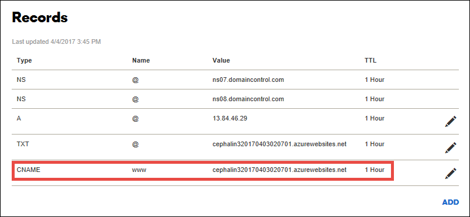

##  Step 4 - Enable the custom DNS in your app

You are now ready to add your configured DNS names (e.g. `contoso.com` and `www.contoso.com`) to your app.

Back in your app's **Custom domains** page in the Azure portal preview (see [Step 1](#info)), you need to add the fully-qualified
domain name (FQDN) of your custom domain to the list.

### Add the A hostname to your app

Click the **+** icon next to **Add hostname**.

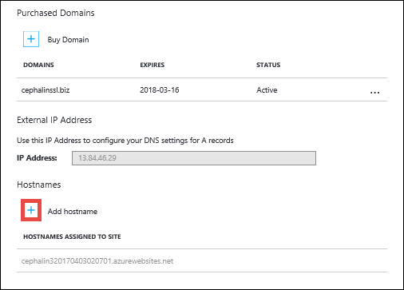

Type the FQDN for which you configured the A record earlier (e.g. `contoso.com`), then click **Validate**.

If you missed a step or made a typo somewhere earlier, you see a verification error at the bottom of the page.

Otherwise, the **Add hostname** button is activated. 

Make sure that **Hostname record type** is set to **A record (example.com)**.

Click **Add hostname** to add the DNS name to your app.

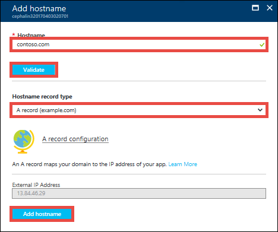

It might take some time for the new hostname to be reflected in your app's **Custom domains** page. Try refreshing the browser to update the data.

###  Add the CNAME hostname to your app

Click the **+** icon next to **Add hostname**.

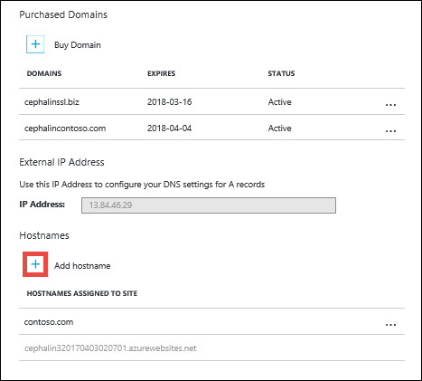

Type the FQDN for which you configured the CNAME record earlier (e.g. `www.contoso.com`), then click **Validate**.

If you missed a step or made a typo somewhere earlier, you see a verification error at the bottom of the page.

Otherwise, the **Add hostname** button is activated. 

Make sure that **Hostname record type** is set to **A record (example.com)**.

Click **Add hostname** to add the DNS name to your app.

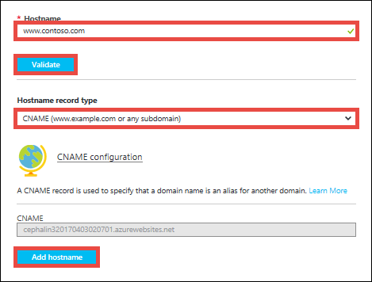

It might take some time for the new hostname to be reflected in your app's **Custom domains** page. Try refreshing the browser to update the data.

### Step 5 - Test in browser

In your browser, browse to the DNS name(s) that you configured earlier (`contoso.com` and `www.contoso.com`).

