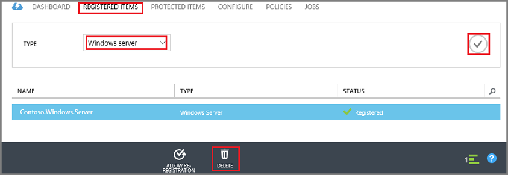

# Delete an Azure Backup vault
The Azure Backup service has two types of vaults - the Backup vault and the Recovery Services vault. The Backup vault came first. Then the Recovery Services vault came along to support the expanded Resource Manager deployments. Because of the expanded capabilities and the information dependencies that must be stored in the vault, deleting a Backup or Recovery Services vault can be confusing. This article explains how to delete the vaults in the Classic Management Portal.  

| **Deployment Type** | **Portal** | **Vault name** |
| --- | --- | --- |
| Classic |Classic |Backup vault |
| Resource Manager |Azure |Recovery Services vault |

> [!NOTE]
> Backup vaults cannot protect Resource Manager-deployed solutions. However, you can use a Recovery Services vault to protect classically deployed servers and VMs.  
>
>

In this article, we use the term, vault, to refer to the generic form of the Backup vault or Recovery Services vault. We use the formal name, Backup vault, or Recovery Services vault, when it is necessary to distinguish between the vaults.

## Delete a backup vault in Classic Management Portal
The following instructions are for deleting a Backup vault in the Classic Management Portal. Before you can delete the Backup vault, you must delete the recovery points, or backed up items, and remove the registered servers. The registered servers are the Windows Server, workstation, or virtual machines that were registered to the vault.

1. Open the [Classic Management Portal](https://manage.windowsazure.cn).

2. From the list of backup vaults, select the vault you want to delete.

    

    The vault dashboard opens. Look at the number of Windows Servers and/or Azure virtual machines associated with the vault. Also, look at the total storage consumed in Azure. Stop all backup jobs and delete all data before deleting the vault.

3. Click the **Protected Items** tab, and then click **Stop Protection**

    

    The **Stop protection of 'your vault'** dialog appears.
4. In the **Stop protection of 'your vault'** dialog, check **Delete associated backup data** and click .  
    Optionally, you can choose a reason for stopping protection, and provide a comment.

    

    After deleting the items in the vault, the vault will be empty.

    
5. In the list of tabs, click **Registered Items**. The **Type** drop-down menu, enables you to choose the type of server registered to the vault. The type can be Windows Server or Azure Virtual Machine. In the following example, select the virtual machine registered to the vault, and click **Unregister**.

	

	If you want to delete the registration for a Windows Server, from the **Type** drop-down menu, select **Windows Server**, click  to refresh the screen, and then click **Delete**.  

	

6. In the list of tabs, click **Dashboard** to open that tab. Verify there are no registered servers or Azure virtual machines protected in the cloud. Also, verify there is no data in storage. Click **Delete** to delete the vault.

    

    The Delete Backup vault confirmation screen opens. Select an option why you're deleting the vault, and click .  

    

    The vault is deleted, and you return to the Classic Management Portal dashboard.

