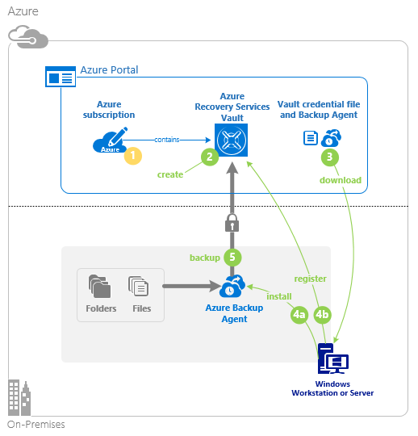

# First look: back up files and folders in Resource Manager deployment
This article explains how to back up your Windows Server (or Windows computer) files and folders to Azure using a Resource Manager deployment. It's a tutorial intended to walk you through the basics. If you want to get started using Azure Backup, you're in the right place.

If you want to know more about Azure Backup, read this [overview](backup-introduction-to-azure-backup.md).

Backing up files and folders to Azure requires these activities:

 Get an Azure subscription (if you don't already have one).<br>
 Create a Recovery Services vault.<br>
 Download and Install and register the Recovery Services agent.<br>
 Back up your files and folders.



## Get an Azure subscription
If you don't have an Azure subscription, create a [Trial](/pricing/1rmb-trial/) that lets you access any Azure service.

## Create a recovery services vault
To back up your files and folders, you need to create a Recovery Services vault in the region where you want to store the data. You also need to determine how you want your storage replicated.

A Recovery Services vault is an entity that stores all the backups and recovery points you create over time. The Recovery Services vault also contains the backup policy applied to the protected files and folders. When you create a Recovery Services vault, you should also select the appropriate storage redundancy option.

The following steps lead you through creating a Recovery Services vault. A Recovery Services vault is different than a Backup vault.

1. login with your subscription using command below.

    ```
    Login-AzureRmAccount -EnvironmentName AzureChinaCloud
    ```

2. If you are using Azure Backup for the first time, you must use the **[Register-AzureRMResourceProvider](https://msdn.microsoft.com/library/mt679020.aspx)** cmdlet to register the Azure Recovery Service provider with your subscription.

    ```
    PS C:\> Register-AzureRmResourceProvider -ProviderNamespace "Microsoft.RecoveryServices"
    ```
3. The Recovery Services vault is a Resource Manager resource, so you need to place it within a resource group. You can use an existing resource group, or create a new resource group with the **[New-AzureRmResourceGroup](https://msdn.microsoft.com/library/mt678985.aspx)** cmdlet. When creating a new resource group, specify the name and location for the resource group.  

    ```
    PS C:\> New-AzureRmResourceGroup –Name "test-rg" –Location "West US"
    ```
4. Use the **[New-AzureRmRecoveryServicesVault](https://msdn.microsoft.com/library/mt643910.aspx)** cmdlet to create the new vault. Be sure to specify the same location for the vault as was used for the resource group.

    ```
    PS C:\> New-AzureRmRecoveryServicesVault -Name "testvault" -ResourceGroupName " test-rg" -Location "West US"
    ```
5. Specify the type of storage redundancy to use; you can use [Locally Redundant Storage (LRS)](../storage/storage-redundancy.md#locally-redundant-storage) or [Geo Redundant Storage (GRS)](../storage/storage-redundancy.md#geo-redundant-storage). The following example shows the -BackupStorageRedundancy option for testVault is set to GeoRedundant.

    ```
    PS C:\> $vault1 = Get-AzureRmRecoveryServicesVault –Name "testVault"
    PS C:\> Set-AzureRmRecoveryServicesBackupProperties  -Vault $vault1 -BackupStorageRedundancy GeoRedundant
    ```

   > [!TIP]
   > Many Azure Backup cmdlets require the Recovery Services vault object as an input. For this reason, it is convenient to store the Backup Recovery Services vault object in a variable.
   >
   >


## Download and Install and register the agent

> [!NOTE]
> Enabling backup through the Azure portal is not available, yet. Use the Azure Recovery Services Agent to back up your files and folders.

You can see [here](./backup-configure-vault-classic.md/#download-install-register-backup-agent) to get details about how to download, install and register the agent.

## Back up your files and folders
The initial backup includes two key tasks:

- Schedule the backup
- Back up files and folders for the first time

To complete the initial backup, use the Azure Recovery Services agent.

### To schedule the backup job
1. Open the Azure Recovery Services agent. You can find it by searching your machine for **Azure Backup**.

    
2. In the Recovery Services agent, click **Schedule Backup**.

    
3. On the Getting started page of the Schedule Backup Wizard, click **Next**.
4. On the Select Items to Backup page, click **Add Items**.
5. Select the files and folders that you want to back up, and then click **Okay**.
6. Click **Next**.
7. On the **Specify Backup Schedule** page, specify the **backup schedule** and click **Next**.

    You can schedule daily (at a maximum rate of three times per day) or weekly backups.

    

   > [!NOTE]
   > For more information about how to specify the backup schedule, see the article [Use Azure Backup to replace your tape infrastructure](backup-azure-backup-cloud-as-tape.md).
   >

8. On the **Select Retention Policy** page, select the **Retention Policy** for the backup copy.

    The retention policy specifies how long the backup data is stored. Rather than specifying a “flat policy” for all backup points, you can specify different retention policies based on when the backup occurs. You can modify the daily, weekly, monthly, and yearly retention policies to meet your needs.
9. On the Choose Initial Backup Type page, choose the initial backup type. Leave the option **Automatically over the network** selected, and then click **Next**.

    You can back up automatically over the network, or you can back up offline. The remainder of this article describes the process for backing up automatically. If you prefer to do an offline backup, review the article [Offline backup workflow in Azure Backup](backup-azure-backup-import-export.md) for additional information.
10. On the Confirmation page, review the information, and then click **Finish**.
11. After the wizard finishes creating the backup schedule, click **Close**.

### To back up files and folders for the first time
1. In the Recovery Services agent, click **Back Up Now** to complete the initial seeding over the network.

    
2. On the Confirmation page, review the settings that the Back Up Now Wizard will use to back up the machine. Then click **Back Up**.
3. Click **Close** to close the wizard. If you close the wizard before the backup process finishes, the wizard continues to run in the background.

After the initial backup is completed, the **Job completed** status appears in the Backup console.


## Questions?
If you have questions, or if there is any feature that you would like to see included, [send us feedback](http://aka.ms/azurebackup_feedback).

## Next steps
- Get more details about [backing up Windows machines](backup-configure-vault.md).
- Now that you've backed up your files and folders, you can [manage your vaults and servers](backup-azure-manage-windows-server.md).
- If you need to restore a backup, use this article to [restore files to a Windows machine](backup-azure-restore-windows-server.md).

