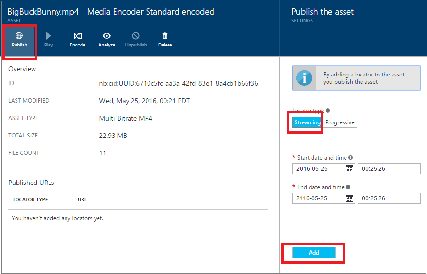
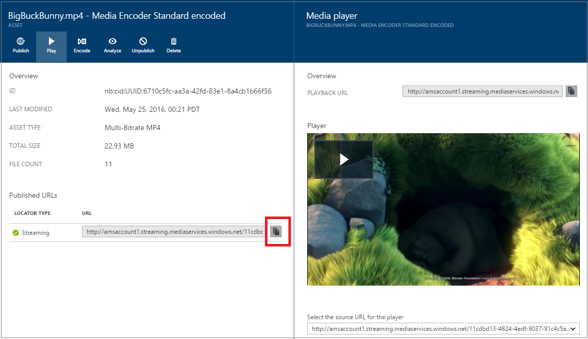

# Publish content with the Azure portal

> [!div class="op_single_selector"]
>- [Portal](./media-services-portal-publish.md)
>- [.NET](./media-services-deliver-streaming-content.md)
>- [REST](./media-services-rest-deliver-streaming-content.md)

## Overview

> [!NOTE]
> To complete this tutorial, you need an Azure account. For details, see [Azure Trial](https://www.azure.cn/pricing/1rmb-trial/). 

To provide your user with a  URL that can be used to stream or download your content, you first need to "publish" your asset by creating a locator. Locators provide access to files contained in the asset. Media Services supports two types of locators: 

* Streaming (OnDemandOrigin) locators, used for adaptive streaming (for example, to stream MPEG DASH, HLS, or Smooth Streaming). To create a streaming locator your asset must contain an .ism file. 
* Progressive (SAS) locators, used for delivery of video via progressive download.

A streaming URL has the following format and you can use it to play Smooth Streaming assets.

```
{streaming endpoint name-media services account name}.streaming.mediaservices.chinacloudapi.cn/{locator ID}/{filename}.ism/Manifest
```

To build an HLS streaming URL, append (format=m3u8-aapl) to the URL.

```
{streaming endpoint name-media services account name}.streaming.mediaservices.chinacloudapi.cn/{locator ID}/{filename}.ism/Manifest(format=m3u8-aapl)
```

To build an  MPEG DASH streaming URL, append (format=mpd-time-csf) to the URL.

```
{streaming endpoint name-media services account name}.streaming.mediaservices.chinacloudapi.cn/{locator ID}/{filename}.ism/Manifest(format=mpd-time-csf)
```

A SAS URL has the following format.

```
{blob container name}/{asset name}/{file name}/{SAS signature}
```

For more information, see [Delivering content overview](./media-services-deliver-content-overview.md).

>[!NOTE]
> If you used the portal to create locators before March 2015, locators with a two year expiration date were created.  

To update an expiration date on a locator, use [REST](http://msdn.microsoft.com/zh-cn/library/azure/hh974308.aspx#update_a_locator ) or [.NET](https://msdn.microsoft.com/zh-cn/library/azure/microsoft.windowsazure.mediaservices.client.ilocator.update(v=azure.10).aspx) APIs. Note that when you update the expiration date of a SAS locator, the URL changes.

### To use the portal to publish an asset
To use the portal to publish an asset, do the following:

1. In the [Azure portal](https://portal.azure.cn/), select your Azure Media Services account.
2. Select **Settings** > **Assets**.
3. Select the asset that you want to publish.
4. Click the **Publish** button.
5. Select the locator type.
6. Press **Add**.

    

The URL will be added to the list of **Published URLs**.

## Play content from the portal
The Azure portal provides a content player that you can use to test your video.

Click the desired video and then click the **Play** button.



Some considerations apply:

- Make sure the video has been published.
- This **Media player** plays from the default streaming endpoint. If you want to play from a non-default streaming endpoint, click to copy the URL and use another player. For example, [Azure Media Services Player](http://amsplayer.azurewebsites.net/azuremediaplayer.html).
- The streaming endpoint from which you are streaming must be running.  
- To stream from a streaming endpoint, you should add at least one streaming unit. For more information, see [this](./media-services-portal-scale-streaming-endpoints.md) topic.