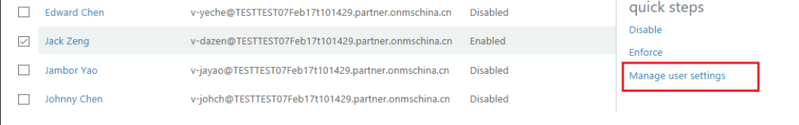
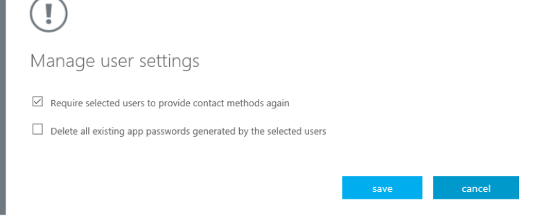

# Manage your settings for two-step verification
This article answers questions about how to update settings for two-step verification or multi-factor authentication. If you are having issues signing in to your account, refer to [Having trouble with two-step verification](multi-factor-authentication-end-user-troubleshoot.md) for troubleshooting help.

## Where to find the settings page
Depending on how your company set up Azure Multi-Factor Authentication, there are a few places where you can change your settings like your phone number.

If your IT admin sent out a specific URL or steps to manage two-step verification, follow those instructions. Otherwise, the following instructions should work for everybody else. If you follow these steps but don't see the same options, that means that your work or school customized their own portal. Ask your admin for the link to your Azure Multi-Factor Authentication portal.

1. Sign in to [https://login.partner.microsoftonline.cn](https://login.partner.microsoftonline.cn)  

	  

	Input user account and password, then click "Sign in".	

2. Select the verification you want.

    - The default is "Authentication phone", you can choose to receive a text massage or a call.
        
	  

    - You can choose "Office phone" too.
    
             
    
    - You can also choose "Mobile phone" to install an "Azure Authentication app" to do verification.
    
         

## I want to change my phone number, or add a secondary number

If you want to change your phone number, you can take the following steps.

1. login [Azure classical portal](https://manage.windowsazure.cn/)

2. Get into “Multi-factor authentication” configuration page from Active Directory.

3. Click “Manage user settings”. There will be a popup page.

	  

4. Choose "Require selected user to provide contact methods again" on the page.

	  

5. click "Save".

Now when you login [https://login.partner.microsoftonline.cn](https://login.partner.microsoftonline.cn) next time, 
you will be able to choose new method of verification or phone number.

## How do I clean up Microsoft Authenticator from my old device and move to a new one?
When you uninstall the app from your device or reset the device, it does not remove the activation on the back end. For more information, see [Microsoft Authenticator](microsoft-authenticator-app-how-to.md).

## Next steps
- Get troubleshooting tips and help on [Having trouble with two-step verification](multi-factor-authentication-end-user-troubleshoot.md)
- Set up [app passwords](multi-factor-authentication-end-user-app-passwords.md) for any apps that don't support two-step verification.

