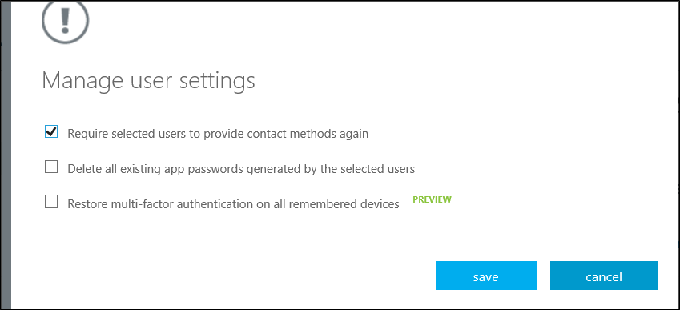

# Managing user settings with Azure Multi-Factor Authentication in the cloud
As an administrator, you can manage the following user and device settings:

- Require selected users to provide contact methods again
- Delete users existing app passwords

## Require selected users to provide contact methods again
This setting will forces the user to complete the registration process again when he or she signs in. Be aware that non-browser apps will continue to work if the user has app passwords for them.  You can delete the users app passwords by also selecting **Delete all existing app passwords generated by the selected users**.

### How to require users to provide contact methods again
1. Sign-in to the Azure Classic Management Portal.
2. On the left, click Active Directory.
3. Under, Directory click on the directory for the user you want to require to provide their contact method again.
4. At the top, click Users.
5. At the bottom of the page, click Manage Multi-Factor Auth. This will open the multi-factor authentication page.
6. Find the user that you wish to manage and place a check in the box located next to the name. You may need to change the view at the top.
7. This will bring up the **Manage user settings** link on the right. Click it.
8. Place a check in **Require selected users to provide contact methods again**.
   
9. Click save.
10. Click close

## Delete users existing app passwords
This deletes all of the app passwords that a user has created. Non-browser apps that were associated with these app passwords will cease to work until a new app password is created.

### How to delete users existing app passwords
1. Sign-in to the Azure Classic Management Portal.
2. On the left, click Active Directory.
3. Under, Directory click on the directory for the user you wish to delete app passwords for.
4. At the top, click Users.
5. At the bottom of the page, click Manage Multi-Factor Auth. This will open the multi-factor authentication page.
6. Find the user that you wish to manage and place a check in the box located next to the name. You may need to change the view at the top.
7. This will bring up the **Manage user settings** link on the right. Click it.
8. Place a check in **Delete all existing app passwords generated by the selected users**.
   
9. Click save.
10. Click close.

