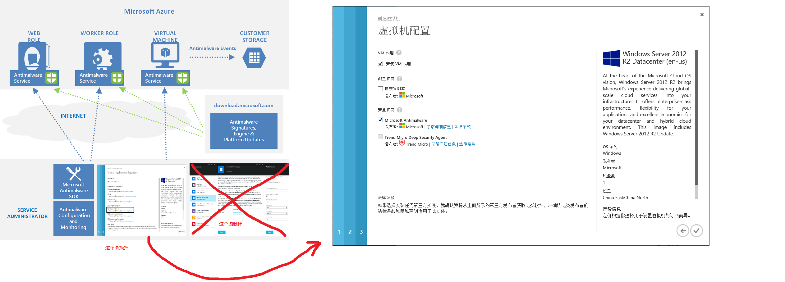
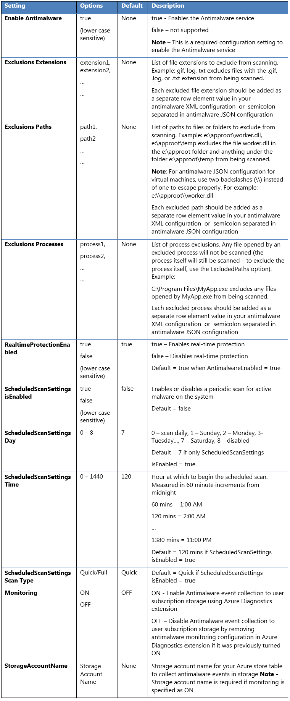
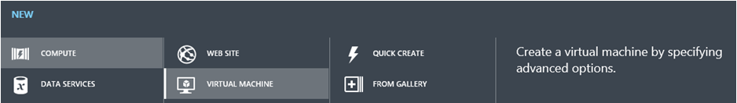
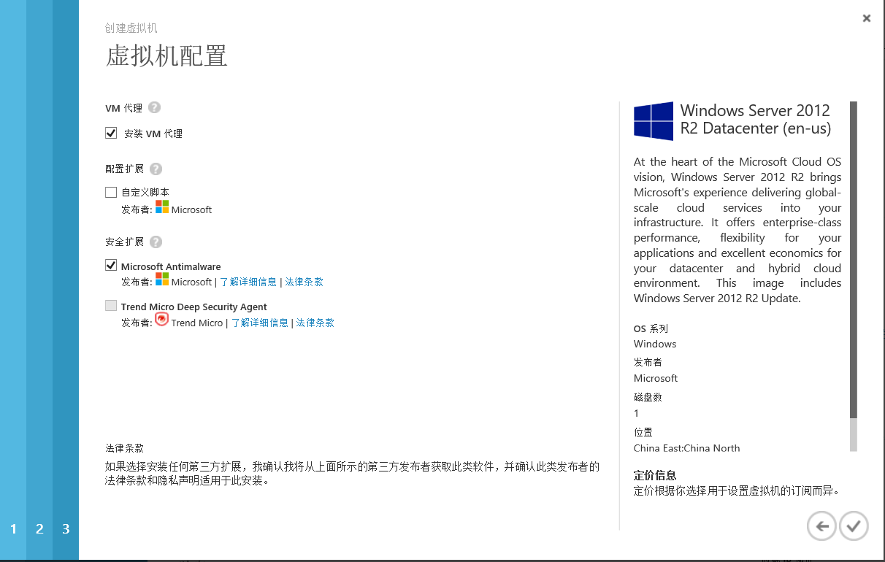

#Microsoft Antimalware for Azure Cloud Services and Virtual Machines

The modern threat land scape for cloud environments is extremely dynamic, increasing the pressure on business IT cloud subscribers to maintain effective protection in order to meet compliance and security requirements. Microsoft Antimalware for Azure Cloud Services and Virtual Machines is free real-time protection capability that helps identify and remove viruses, spyware, and other malicious software, with configurable alerts when known malicious or unwanted software attempts to install itself or run on your Azure systems.

The solution is built on the same antimalware platform as Microsoft Security Essentials \[MSE\], Microsoft Forefront Endpoint Protection, Microsoft System Center Endpoint Protection, Windows Intune, and Windows Defender for Windows 8.0 and higher. Microsoft Antimalware for Azure is a single-agent solution for applications and tenant environments, designed to run in the background without human intervention. You can deploy protection based on the needs of your application workloads, with either basic secure-by-default or advanced custom configuration, including antimalware monitoring.

When you deploy and enable Microsoft Antimalware for Azure for your applications, the following core features are available:

- **Real-time protection** - monitors activity in Cloud Services and on Virtual Machines to detect and block malware execution.
- **Scheduled scanning** - periodically performs targeted scanning to detect malware, including actively running programs.
- **Malware remediation** - automatically takes action on detected malware, such as deleting or quarantining malicious files and cleaning up malicious registry entries.
- **Signature updates** - automatically installs the latest protection signatures (virus definitions) to ensure protection is up-to-date on a pre-determined frequency.
- **Antimalware Engine updates** – automatically updates the Microsoft Antimalware engine.
- **Antimalware Platform updates** – automatically updates the Microsoft Antimalware platform.
- **Active protection** - reports telemetry metadata about detected threats and suspicious resources to Microsoft Azure to ensure rapid response to the evolving threat landscape, as well as enabling real-time synchronous signature delivery through the Microsoft Active Protection System (MAPS).
- **Samples reporting** - provides and reports samples to the Microsoft Antimalware service to help refine the service and enable troubleshooting.
- **Exclusions** – allows application and service administrators to configure certain files, processes, and drives to exclude them from protection and scanning for performance and/or other reasons.
- **Antimalware event collection** - records the antimalware service health, suspicious activities, and remediation actions taken in the operating system event log and collects them into the customer’s Azure Storage account.

##Architecture

The Microsoft Antimalware for Azure Cloud Services and Virtual Machines solution includes the Microsoft Antimalware Client and Service, Antimalware classic deployment model, Antimalware PowerShell cmdlets and Azure Diagnostics Extension. The Microsoft Antimalware solution is supported on Windows Server 2008 R2, Windows Server 2012, and Windows Server 2012 R2 operating system families. It is not supported on the Windows Server 2008 operating system. At this time, Windows Server Technical Preview is not supported and we intend to support it in the future.

The Microsoft Antimalware Client and Service is installed by default in a disabled state in all supported Azure guest operating system families in the Cloud Services platform. The Microsoft Antimalware Client and Service is not installed by default in the Virtual Machines platform and is available as an optional feature through the Azure portal and Visual Studio Virtual Machine configuration under Security Extensions.

When using Azure Websites, the underlying service that hosts the web app has Microsoft Antimalware enabled on it. This is used to protect Azure Websites infrastructure and does not run on customer content. 

###Microsoft antimalware workflow

The Azure service administrator can enable Antimalware for Azure with a default or custom configuration for your Virtual Machines and Cloud Services using the following options:

-   Virtual Machines – Using the Visual Studio virtual machines configuration in Server Explorer

-   Virtual Machines and Cloud Services – Using the Antimalware [classic deployment model](https://msdn.microsoft.com/library/azure/ee460799.aspx)

-   Virtual Machines and Cloud Services – Using Antimalware PowerShell cmdlets

The Azure portal or PowerShell cmdlets push the Antimalware extension package file to the Azure system at a pre-determined fixed location. The Azure Guest Agent (or the Fabric Agent) launches the Antimalware Extension, applying the Antimalware configuration settings supplied as input. This step enables the Antimalware service with either default or custom configuration settings. If no custom configuration is provided, then the antimalware service is enabled with the default configuration settings. Refer to the *Antimalware configuration* section in the [Microsoft Antimalware for Azure Cloud Services and Virtual Machines – Code Samples](http://aka.ms/amazsamples "Microsoft Antimalware For Azure Cloud Services and VMs Code Samples") for more details.

Once running, the Microsoft Antimalware client downloads the latest protection engine and signature definitions from the Internet and loads them on the Azure system. The Microsoft Antimalware service writes service-related events to the system OS events log under the “Microsoft Antimalware” event source. Events include the Antimalware client health state, protection and remediation status, new and old configuration settings, engine updates and signature definitions, and others.

You can enable Antimalware monitoring for your Cloud Service or Virtual Machine to have the Antimalware event log events written as they are produced to your Azure storage account. The Antimalware Service uses the Azure Diagnostics extension to collect Antimalware events from the Azure system into tables in the customer’s Azure Storage account.

The deployment workflow including configuration steps and options supported for the above scenarios are documented in [Antimalware deployment scenarios](#_Antimalware_Deployment_Scenarios) section of this document.

> [!NOTE]
> You can however use Powershell/APIs and Azure Resource Manager templates to deploy Virtual Machine Scale Sets with the Microsoft Anti-Malware extension.  For installing an extension on an already running Virtual Machine, you can use the sample python script *vmssextn.py* located [here](https://github.com/gbowerman/vmsstools). This script gets the existing extension config on the Scale Set and adds an extension to the list of existing extensions on the VM Scale Sets.

###Default and Custom Antimalware Configuration

The default configuration settings are applied to enable Antimalware for Azure Cloud Services or Virtual Machines when you do not provide custom configuration settings. The default configuration settings have been pre-optimized for running in the Azure environment. Optionally, you can customize these default configuration settings as required for your Azure application or service deployment and apply them for other deployment scenarios.

> [!NOTE]
> By default the Microsoft Antimalware User Interface on Azure Resource Manager is disabled, [cleanuppolicy.xml](https://blogs.msdn.microsoft.com/azuresecurity/2016/02/24/update-on-microsoft-antimalware-and-azure-resource-manager-arm-vms/) file to bypass this error message is not supported. For information on how to create a custom policy, read [Enabling Microsoft Antimalware User Interface on Azure Resource Manager VMs Post Deployment](https://blogs.msdn.microsoft.com/azuresecurity/2016/03/09/enabling-microsoft-antimalware-user-interface-post-deployment/). 

The following table summarizes the configuration settings available for the Antimalware service. The default configuration settings are marked under the column labeled “Default” below.

##Antimalware Deployment Scenarios

The scenarios to enable and configure antimalware, including monitoring for Azure Cloud Services and Virtual Machines, are discussed in this section.

###Virtual machines - enable and configure antimalware

**Deployment using the Azure classic portal**

To enable and configure Microsoft Antimalware for Azure Virtual Machines using the Azure portal while provisioning a Virtual Machine, follow the steps below:

<<<<<<< HEAD
1.Log onto the Azure portal at <https://portal.azure.cn>
=======
1.Log onto the Azure management at <https://manage.windowsazure.cn>
>>>>>>> c42d4e5d33761c2a0e5ee539e4bd3d1059536a71

2.To create a new virtual machine, click **New**, **Compute**, **Virtual** **Machine**, **From Gallery** (do not use Quick Create) as shown below:

3.Select the **Microsoft Windows Server** image on the **Choose an Image** page.

4.Click the right arrow and input the Virtual Machine configuration.

5.Check the **Microsoft Antimalware** checkbox under **Security Extensions** on the Virtual Machine configuration page.

6.Click the Submit button to enable and configure Microsoft Antimalware for Azure Virtual Machines with the default configuration settings.

**Deployment Using PowerShell cmdlets**

An Azure application or service can enable and configure Microsoft Antimalware for Azure Virtual Machines using PowerShell cmdlets.

To Microsoft antimalware using antimalware PowerShell cmdlets:

1. Set up your PowerShell environment - Refer to the documentation at <https://github.com/Azure/azure-powershell>

2. Set up your PowerShell environment - Refer to the documentation at <https://github.com/Azure/azure-sdk-tools-samples>

3. Use the Set-AzureVMMicrosoftAntimalwareExtension Antimalware cmdlet to enable and configure Microsoft Antimalware as documented at <http://msdn.microsoft.com/library/azure/dn771716.aspx>

4. Use the Get-AzureVMMicrosoftAntimalwareExtension Antimalware cmdlet to get the antimalware configuration as documented at <http://msdn.microsoft.com/library/azure/dn771719.aspx>

**Note:** The Azure Virtual Machines configuration for Antimalware supports only JSON format configuration. The Antimalware JSON configuration settings template is included in the [Microsoft Antimalware For Azure Cloud Services and Virtual Machine - Code Samples](http://aka.ms/amazsamples "Microsoft Antimalware For Azure Cloud Services and Virtual Machine - Code Samples"), showing the supported Antimalware configuration settings.