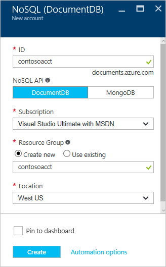

1. In a new window, sign in to the [Azure portal preview](https://portal.azure.cn/).
2. In the Jumpbar, click **New**, click **Databases**, and then click **NoSQL (DocumentDB)**.

     
3. In the **New account** blade, specify the desired configuration for the DocumentDB account.

   

   * In the **ID** box, enter a name to identify the DocumentDB account.  When the **ID** is validated, a green check mark appears in the **ID** box. The **ID** value becomes the host name within the URI. The **ID** may contain only lowercase letters, numbers, and the '-' character, and must be between 3 and 50 characters. Note that *documents.azure.com* is appended to the endpoint name you choose, the result of which becomes your DocumentDB account endpoint.
   * In the **NoSQL API** box, select **DocumentDB**.  
   * For **Subscription**, select the Azure subscription that you want to use for the DocumentDB account. If your account has only one subscription, that account is selected by default.
   * In **Resource Group**, select or create a resource group for your DocumentDB account.  By default, a new resource group is created. For more information, see [Using the Azure portal to manage your Azure resources](../articles/azure-resource-manager/resource-group-portal.md).
   * Use **Location** to specify the geographic location in which to host your DocumentDB account. 
4. Once the new DocumentDB account options are configured, click **Create**. To check the status of the deployment, check the Notifications hub.  

     

   
5. After the DocumentDB account is created, it is ready for use with the default settings. To review the default settings, click the **NoSQL (DocumentDB)** icon on the Jumpbar, click your new account, and then click **Default consistency** in the resource menu.

     

   The default consistency of the DocumentDB account is set to **Session**.  You can adjust the default consistency by selecting one of the other consistency options available. To learn more about the consistency levels offered by DocumentDB, see [Consistency levels in DocumentDB](../articles/documentdb/documentdb-consistency-levels.md).

[How to: Create a DocumentDB account]: #Howto
[Next steps]: #NextSteps
[documentdb-manage]:../articles/documentdb/documentdb-manage.md